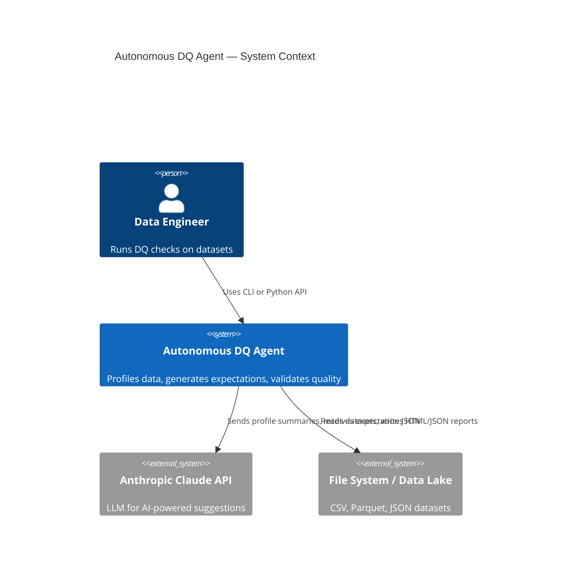
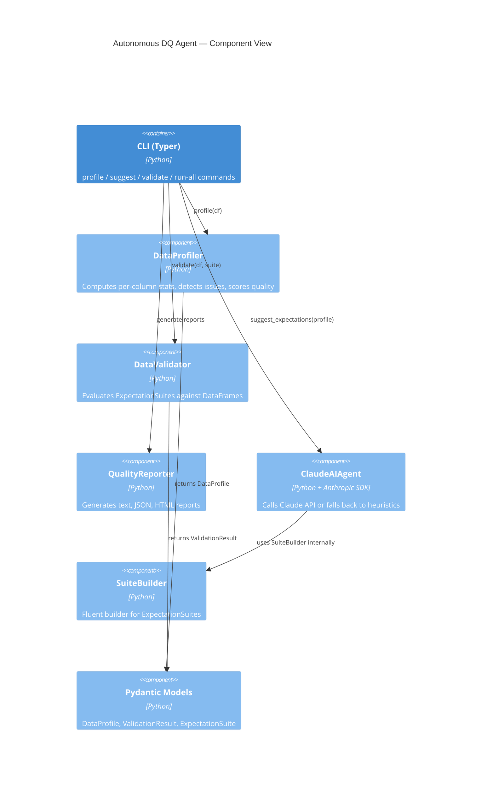
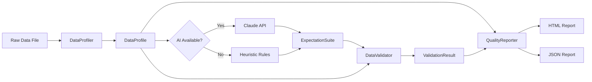

# Architecture — Autonomous DQ Agent

## System Overview

## Component Diagram

## Data Flow

## Quality Score Formula

The overall quality score starts at 100 and deducts penalties per issue:

| Severity | Penalty |
|----------|---------|
| CRITICAL | −20 pts |
| HIGH     | −10 pts |
| MEDIUM   | −5 pts  |
| LOW      | −2 pts  |
| INFO     | −0.5 pts |

Score is clamped to [0, 100].

## Expectation Types

15 expectation types are supported:

| Type | Description |
|------|-------------|
| `expect_column_values_to_not_be_null` | No nulls in column |
| `expect_column_null_rate_to_be_below` | Null rate ≤ threshold |
| `expect_column_values_to_be_between` | Values in [min, max] |
| `expect_column_values_to_be_in_set` | Values in allowed set |
| `expect_column_values_to_not_be_in_set` | Values not in forbidden set |
| `expect_column_values_to_match_regex` | Values match regex |
| `expect_column_mean_to_be_between` | Mean in [min, max] |
| `expect_column_min_to_be_gte` | Min ≥ threshold |
| `expect_column_max_to_be_lte` | Max ≤ threshold |
| `expect_column_values_to_be_unique` | All values unique |
| `expect_table_row_count_to_be_between` | Row count in [min, max] |
| `expect_column_to_exist` | Column present in schema |
| `expect_column_distinct_count_to_be_gte` | Distinct count ≥ min |
| `expect_column_std_to_be_between` | Std dev in [min, max] |
| `expect_column_quantile_values_to_be_between` | Quantile in [min, max] |
